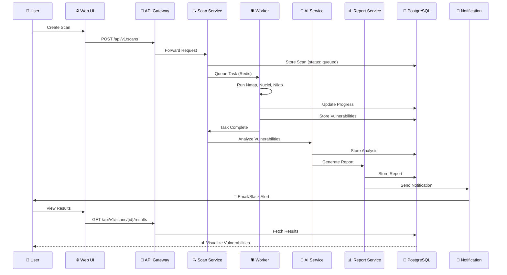
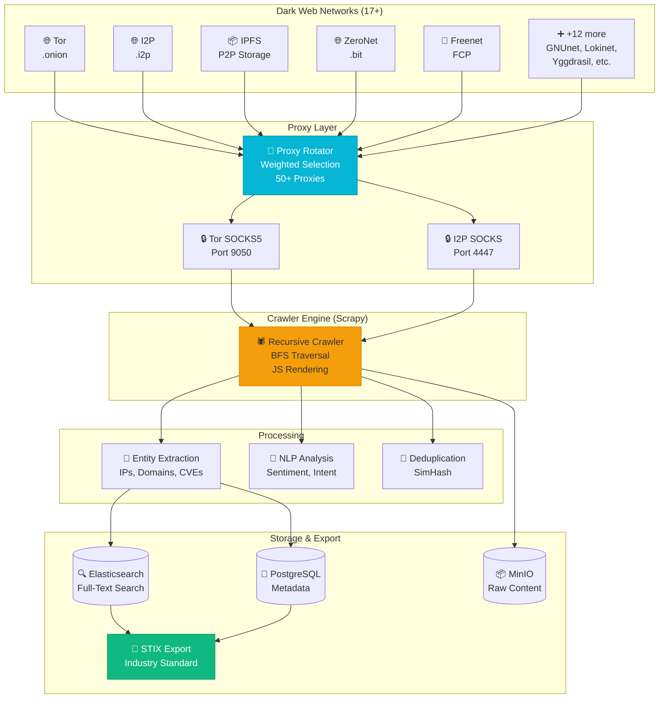
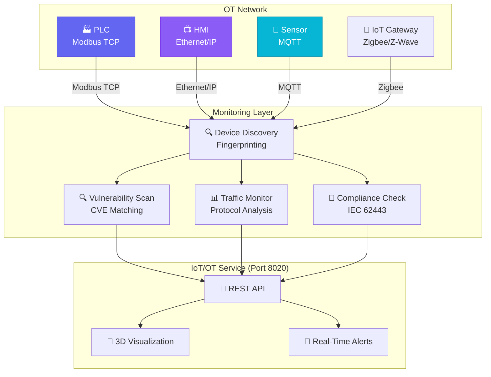
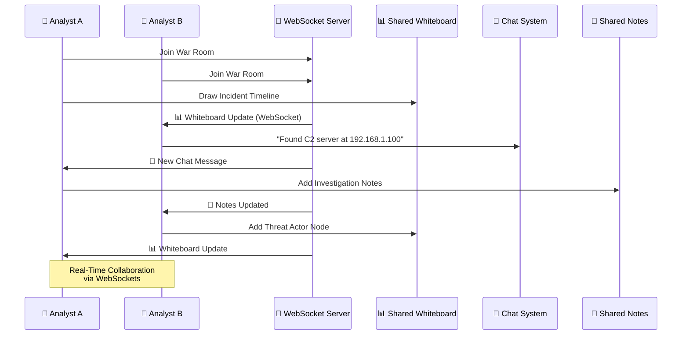

# 🏗️ Architecture Diagrams

## System Architecture (Mermaid)

```mermaid
graph TB
    User[👤 User / SOC Analyst]
    
    subgraph "Frontend Layer"
        Web[🌐 cosmicsec-web<br/>React 19 + TypeScript 5.5<br/>Glassmorphism UI<br/>Port: 3000]
    end
    
    subgraph "API Gateway (Hybrid Router)"
        Gateway[🔀 API Gateway<br/>FastAPI + GraphQL<br/>Port: 8000<br/>Circuit Breaker<br/>Rate Limiting<br/>Service Discovery]
    end
    
    subgraph "Core Services (25+ Microservices)"
        Auth[🔐 Auth Service<br/>Port: 8001<br/>JWT, 2FA, SSO]
        Scan[🔍 Scan Service<br/>Port: 8002<br/>Distributed Scanning]
        AI[🤖 AI Service (Helix)<br/>Port: 8003<br/>30+ Endpoints]
        Recon[🌐 Recon Service<br/>Port: 8004<br/>OSINT + Asset Discovery]
        Report[📊 Report Service<br/>Port: 8005<br/>Multi-Format Export]
        Collab[👥 Collab Service<br/>Port: 8006<br/>SOC Collaboration]
        Bounty[🎯 Bug Bounty<br/>Port: 8007<br/>Vuln Submissions]
    end
    
    subgraph "Advanced Services"
        IoT[🤖 IoT/OT Security<br/>Port: 8020]
        DDoS[🛡️ DDoS Protection<br/>Port: 8021]
        ZTNA[🔐 ZTNA<br/>Port: 8022]
        ThreatIntel[🌐 Threat Intel<br/>Port: 8023]
        SmartContract[📜 Smart Contract<br/>Port: 8024]
        Viz3D[🎨 3D Visualization<br/>Port: 8025]
        BreachSim[🎮 Breach Simulation<br/>Port: 8026]
        Edge[🌐 Edge Computing<br/>Port: 8027]
        SLA[📈 SLA Manager<br/>Port: 8028]
        Theme[🎨 Theme Builder<br/>Port: 8029]
        Onboard[🚀 Onboarding<br/>Port: 8030]
        NLPSearch[🤖 NLP Search<br/>Port: 8031]
    end
    
    subgraph "DeepIntel PRO (Dark Web)"
        DeepIntel[🌐 DeepIntel PRO<br/>Port: 8032<br/>17+ Dark Web Networks<br/>Tor, I2P, IPFS, etc.]
    end
    
    subgraph "Support Services"
        Notify[🔔 Notification<br/>Port: 8011]
        Compliance[📜 Compliance<br/>Port: 8012]
        Org[👥 Org Service<br/>Port: 8013]
        Admin[🔐 Admin Service<br/>Port: 8014]
        Egress[🚪 Egress Service<br/>Port: 8015]
        Ingest[🤖 Ingest (Rust)<br/>Port: 8016]
    end
    
    subgraph "Data Layer"
        PG[(🐘 PostgreSQL<br/>Primary DB)]
        Redis[(🔴 Redis<br/>Cache + Pub/Sub)]
        ES[(🔍 Elasticsearch<br/>Search + Logs)]
        MinIO[(📦 MinIO<br/>Object Storage)]
        Kafka[(📨 Kafka<br/>Event Streaming)]
    end
    
    User --> Web
    Web -->|REST + GraphQL| Gateway
    Gateway --> Auth
    Gateway --> Scan
    Gateway --> AI
    Gateway --> Recon
    Gateway --> Report
    Gateway --> Collab
    Gateway --> Bounty
    Gateway --> IoT
    Gateway --> DDoS
    Gateway --> ZTNA
    Gateway --> ThreatIntel
    Gateway --> DeepIntel
    
    Scan --> PG
    Scan --> Redis
    AI --> PG
    AI --> Redis
    DeepIntel --> ES
    DeepIntel --> MinIO
    
    Auth --> PG
    Auth --> Redis
    
    style Web fill:#6366f1,stroke:#4f46e5,color:#fff
    style Gateway fill:#8b5cf6,stroke:#7c3aed,color:#fff
    style AI fill:#06b6d4,stroke:#0891b2,color:#fff
    style DeepIntel fill:#10b981,stroke:#059669,color:#fff
```

---

## Data Flow: Scan to Report



---

## AI Multi-Model Ensemble

```mermaid
graph LR
    Input[📝 Input:<br/>Vulnerability Data]
    
    subgraph "AI Models"
        GPT[🤖 GPT-4o<br/>96% Accuracy]
        Claude[🤖 Claude 3 Opus<br/>95% Accuracy]
        Llama[🤖 Llama 3.1 70B<br/>91% Accuracy]
    end
    
    subgraph "Ensemble Logic"
        Majority[📊 Majority Vote]
        Weighted[⚖️ Weighted Vote<br/>(by accuracy)]
        Average[📈 Average Score]
        Adaptive[🎯 Adaptive<br/>(context-aware)]
    end
    
    Input --> GPT
    Input --> Claude
    Input --> Llama
    
    GPT --> Majority
    Claude --> Majority
    Llama --> Majority
    
    GPT --> Weighted
    Claude --> Weighted
    Llama --> Weighted
    
    GPT --> Average
    Claude --> Average
    Llama --> Average
    
    Input --> Adaptive
    GPT --> Adaptive
    Claude --> Adaptive
    Llama --> Adaptive
    
    Majority --> Consensus[✅ Consensus Result]
    Weighted --> Consensus
    Average --> Consensus
    Adaptive --> Consensus
    
    style Input fill:#fbbf24,stroke:#f59e0b
    style Consensus fill:#10b981,stroke:#059669,color:#fff
    style GPT fill:#6366f1,stroke:#4f46e5,color:#fff
    style Claude fill:#8b5cf6,stroke:#7c3aed,color:#fff
    style Llama fill:#06b6d4,stroke:#0891b2,color:#fff
```

---

## Dark Web Intelligence (DeepIntel PRO)



---

## Zero-Trust Architecture (ZTNA)

```mermaid
graph TB
    subgraph "User Device"
        User[👤 User Device]
        Posture[📱 Device Posture<br/>OS Version<br/>Antivirus<br/>Patches]
    end
    
    subgraph "Zero-Trust Gateway"
        mTLS[🔐 mTLS Auth<br/>Mutual TLS]
        Policy[📜 Policy Engine<br/>Just-In-Time Access]
        MicroSeg[🔒 Micro-Segmentation<br/>Per-Resource Control]
    end
    
    subgraph "Resources"
        WebApp[🌐 Web App]
        API[🔌 API Server]
        DB[(🐘 Database)]
        FileShare[📁 File Share]
    end
    
    User -->|1. Request Access| mTLS
    Posture -->|2. Posture Check| Policy
    Policy -->|3. Verify Policy| MicroSeg
    MicroSeg -->|4. Grant Temporary Access| WebApp
    MicroSeg -->|4. Grant Temporary Access| API
    MicroSeg -->|❌ Deny (if fails)| DB
    MicroSeg -->|❌ Deny (if fails)| FileShare
    
    WebApp -->|Log Access| Audit[📝 Audit Log]
    API -->|Log Access| Audit
    
    style mTLS fill:#ef4444,stroke:#dc2626,color:#fff
    style Policy fill:#f59e0b,stroke:#d97706
    style MicroSeg fill:#10b981,stroke:#059669,color:#fff
```

---

## IoT/OT Security Architecture



---

## Real-Time Collaboration (SOC War Room)



---

## CI/CD Pipeline

```mermaid
graph LR
    subgraph "Development"
        Code[💻 Code Commit]
        PR[📬 Pull Request]
    end
    
    subgraph "CI Pipeline (GitHub Actions)"
        Test[🧪 Run Tests<br/>pytest, vitest, go test]
        Build[🏗️ Build Images<br/>Docker Build]
        Scan[🔍 Security Scan<br/>Snyk, Grype]
    end
    
    subgraph "CD Pipeline"
        Staging[🎭 Deploy to Staging]
        TestStaging[🧪 Integration Tests]
        Prod[🚀 Deploy to Production]
    end
    
    subgraph "GitOps (ArgoCD)"
        Monitor[👀 Monitor Git]
        Sync[🔄 Sync K8s Manifests]
    end
    
    Code --> PR
    PR --> Test
    Test --> Build
    Build --> Scan
    
    Scan --> Staging
    Staging --> TestStaging
    TestStaging --> Prod
    
    Prod --> Monitor
    Monitor --> Sync
    
    style Test fill:#10b981,stroke:#059669,color:#fff
    style Prod fill:#ef4444,stroke:#dc2626,color:#fff
    style Sync fill:#8b5cf6,stroke:#7c3aed,color:#fff
```



---

## Next Steps

- [Architecture Overview](../architecture/overview.md)
- [API Gateway Details](../architecture/gateway.md)
- [Service Discovery](../architecture/service-discovery.md)
- [Microservices Overview](../services/)
