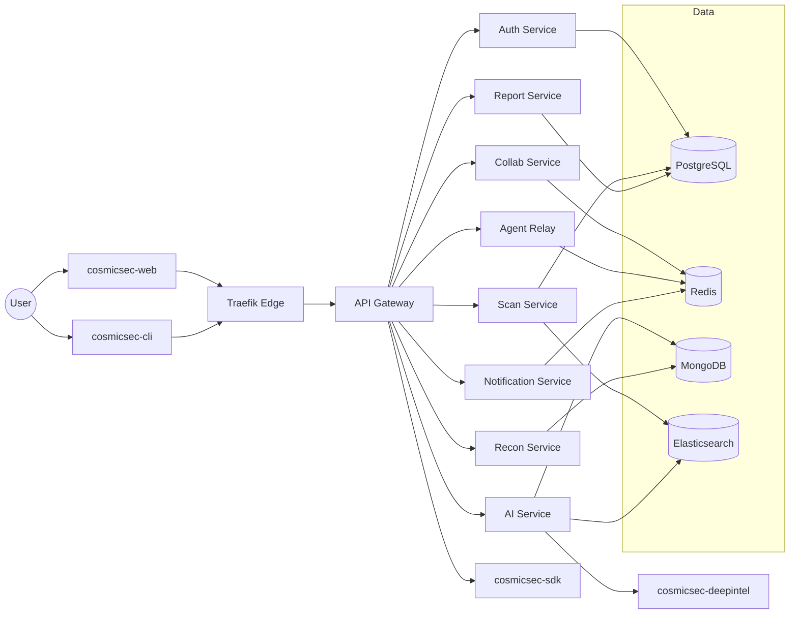

# CosmicSec Architecture

> Supplemental architecture narrative.
> Canonical implementation status remains in `report.md`, `ROADMAP.md`, and `gap_analysis.md`.

## Architectural Overview

CosmicSec follows a **Microservices-based, AI-native Hybrid Architecture**. It unifies vulnerability scanning, recon, threat analysis, reporting, and team collaboration into a single, modern platform. 

The architecture supports multiple operation modes:
- **STATIC**: Pre-rendered landing and feature demo.
- **DYNAMIC**: Cloud/self-hosted full dashboard.
- **LOCAL**: CLI/Terminal agent running on user's local machine.

## Subsystems

### 1. Edge & Routing Layer
- **Traefik v3**: Acts as the main edge gateway providing TLS, load balancing, and rate limiting.
- **API Gateway (Port 8000)**: Built on FastAPI. Features a HybridRouter, GraphQL runtime, WebSocket hub, OpenTelemetry tracing, and WAF middleware.

### 2. Microservices Layer (Backend)
- **Auth Service (8001)**: JWT, OAuth2 SSO, TOTP/2FA, Casbin RBAC.
- **Scan Service (8002)**: Distributed scanner orchestration, manages Celery tasks, persists agent findings.
- **AI Service (8003)**: LangChain/LangGraph, ChromaDB for RAG, MITRE ATT&CK mapping, default `phi3:mini` model integration, NDJSON stream proxy.
- **Recon Service (8004)**: Passive OSINT, DNS enum, Shodan, Tor/onion workflows.
- **Report Service (8005)**: PDF/HTML generation, SOC2/HIPAA compliance templates.
- **Collab Service (8006)**: WebSocket rooms, live chat, presence tracking.
- **Plugin Registry (8007)**: Manages official and community SDK plugins, Ed25519 signing.
- **Bug Bounty Svc (8009)**: Manages hacker submissions and lifecycle workflows.
- **Professional SOC (8010)**: Incident response and DevSecOps gates (formerly Phase5).
- **Agent Relay (8011)**: WebSocket hub connecting CLI agents to the cloud.
- **Notification Svc (8012)**: Slack, Email push channels.

### 3. Data Persistence Layer
- **PostgreSQL**: Core relational data (users, scans, findings, workspaces, plugins).
- **MongoDB**: Unstructured OSINT recon evidence and AI context.
- **Redis**: Caching, session states, Celery broker, WebSocket pub/sub.
- **Elasticsearch**: Centralized logging and fast full-text search.

### 4. Client Layer
- **Frontend (WebApp)**: React 19, TypeScript, Vite, TailwindCSS v4. Features a centralized API client, Zustand persistence, advanced tool panels.
- **CLI Local Agent**: Python + Rust. Discovers tools natively (including WSL fallback), executes via shell, streams output to cloud.

---

## Inter-Repo Wiring (Proposed Standard)

CosmicSec stays split into **9 repositories** but exposes a unified platform through a single **Edge → Gateway → Mesh** pipeline:

1. **Edge** (Traefik) terminates TLS and applies coarse rate limiting.
2. **API Gateway** (cosmicsec-core) applies auth, tenant isolation, and route policy.
3. **Service Mesh** routes traffic to dedicated services (cosmicsec-services, cosmicsec-ai, cosmicsec-deepintel).
4. **Clients** (cosmicsec-web + cosmicsec-cli + cosmicsec-sdk) consume versioned API + WebSocket channels.

### Gateway Topology (Logical)

### Service Contracts (Proposed Standard)
- **HTTP**: Versioned routes: `/api/v1/...`, `/api/v2/...`
- **WebSocket**: `/ws/v1/...` (events, agent relay, collaboration)
- **Async Events**: Internal event bus (Redis Streams or NATS) with `events.<domain>.*` topics.
- **Observability**: OpenTelemetry traces + structured logs with `trace_id` and `tenant_id`.

### Standard Route Groups
- `/api/v1/auth/*`
- `/api/v1/scan/*`
- `/api/v1/ai/*`
- `/api/v1/recon/*`
- `/api/v1/report/*`
- `/api/v1/collab/*`
- `/api/v1/agents/*`
- `/api/v1/notify/*`

---

---

## Scope Note

This file is architecture context only.
Implementation status, completion percentages, and active gap tracking are maintained in `report.md`, `ROADMAP.md`, and `gap_analysis.md`.

See `gateway-routing.md` for the unified routing blueprint.
