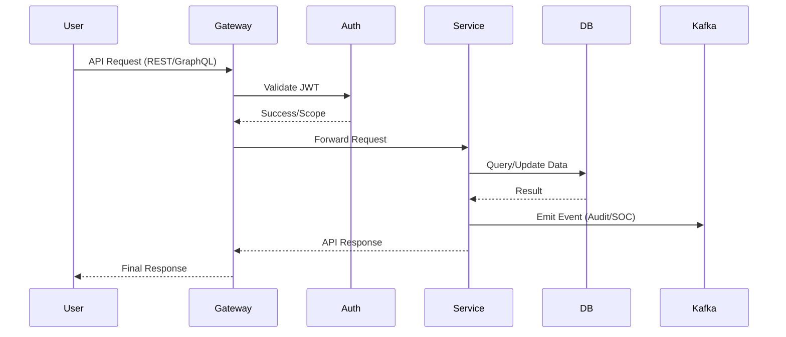

# Data Flow Architecture

CosmicSec utilizes a multi-layer data architecture to handle high-volume security events, real-time analytics, and persistent storage.

## 1. Request Lifecycle

## 2. Multi-Layer Storage

We use a "Right Tool for the Job" approach for data persistence:

| Layer | Technology | Purpose |
| :--- | :--- | :--- |
| **Relational** | PostgreSQL | Primary application state, RBAC, Metadata. |
| **Document** | MongoDB | Unstructured scan results, darkweb crawler dumps. |
| **Key-Value** | Redis | Tiered caching (L2), rate limiting, token blacklist. |
| **Search** | Elasticsearch | High-performance log searching and threat indexing. |
| **Streaming** | Kafka | Real-time event bus for service-to-service communication. |

## 3. Real-Time Event Processing

Security events (e.g., scan findings, anomaly detections) follow an asynchronous processing pipeline:

1.  **Ingestion**: Services emit events to dedicated Kafka topics.
2.  **Enrichment**: The AI Helix engine consumes events, enriches them with threat intelligence (DeepIntel), and maps them to MITRE ATT&CK.
3.  **Action**: The SOC service consumes enriched events to update dashboards and trigger alerts via the Notification Service.
4.  **Archival**: Events are indexed into Elasticsearch for long-term searching and auditing.

## 4. Tiered Caching Strategy

To ensure low latency, we implement a two-tier caching model:

*   **L1 (In-Memory)**: Local service-level cache for frequently accessed configuration.
*   **L2 (Redis)**: Distributed cache for shared session data, rate limits, and cross-service lookups.

## 5. Data Residency

(See [Core Platform Documentation](../modules/core-platform/)) for details on how we handle data residency requirements via our specialized `data_residency` module, ensuring compliance with local laws by pinning data to specific geographic regions.
