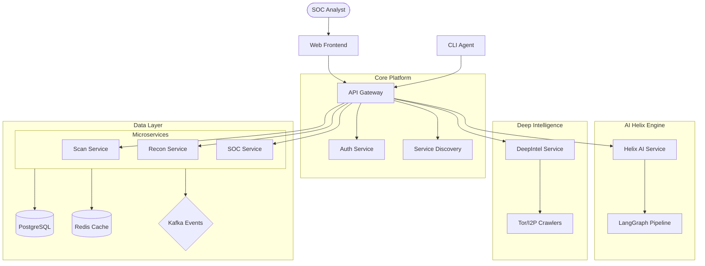

# Architecture Overview

## System Philosophy

CosmicSec is built as a high-performance, modular, and secure-by-default security operations platform. Our architecture prioritizes:

1.  **Modularity**: Each component is a self-contained microservice or package.
2.  **Resilience**: Circuit breakers, rate limiting, and redundant data stores ensure high availability.
3.  **Security**: Zero-Trust principles, mTLS, and Post-Quantum Cryptography.
4.  **AI-First**: Autonomous agents are integrated into the core workflows.
5.  **Observability**: Full OpenTelemetry OTLP tracing and structured JSON logging.
6.  **Modern Stack**: Powered by Python 3.13, React 19, and Vite 6.

## High-Level Diagram

## Core Components

### 1. API Gateway (cosmicsec-core)
The central entry point for all client requests. It handles routing, authentication, rate limiting, and circuit breaking.

### 2. Microservices (cosmicsec-services)
Functional modules that handle specific security tasks like scanning, reporting, and incident management.

### 3. AI Helix (cosmicsec-ai)
The autonomous brain of the platform, leveraging LLMs and LangGraph to automate complex security analysis.

### 4. DeepIntel (cosmicsec-deepintel)
A specialized intelligence gathering module focused on darknet monitoring and threat actor tracking.

### 5. SDKs & CLI (cosmicsec-sdk, cosmicsec-cli)
Tools for developers and power users to interact with the platform programmatically and via terminal.

## Cross-Cutting Concerns

*   **Observability**: Integrated Prometheus and Grafana for metrics.
*   **Identity**: Unified RBAC and SSO (SAML/OIDC).
*   **Deployment**: Cloud-native with Kubernetes and Docker Compose.
