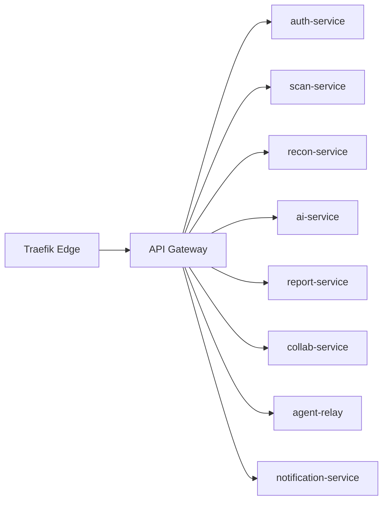

# CosmicSec Gateway Routing Blueprint

This document defines the **standardized routing map** for the CosmicSec platform and the expected routing contract across all repos.

## Route Prefixes

### Public
- `GET /health`
- `GET /api/docs`
- `GET /api/openapi.json`

### Auth & Identity
- `/api/v1/auth/*`
- `/api/v1/orgs/*`
- `/api/v1/tenants/*`

### Core Platform
- `/api/v1/scans/*`
- `/api/v1/findings/*`
- `/api/v1/recon/*`
- `/api/v1/reports/*`
- `/api/v1/ai/*`
- `/api/v1/agents/*`
- `/api/v1/collab/*`
- `/api/v1/notify/*`

### Admin / Platform
- `/api/platform/*`
- `/api/runtime/*`

### WebSockets
- `/ws/v1/agents/*`
- `/ws/v1/collab/*`
- `/ws/v1/stream/*`

## Gateway Flow (Edge → Gateway → Services)

## Versioning Policy
- **Stable**: `/api/v1` (default)
- **Preview**: `/api/v2` (breaking changes behind feature flags)
- **Internal**: `/api/internal/*` (no external SLA)

## Response Contract
All HTTP responses must include:
- `_runtime`: route path + degradation mode
- `_contract`: schema version + deprecation info
- `trace_id`: if tracing is enabled
